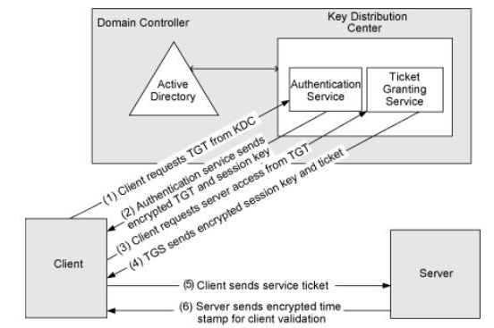

# Kerberos authentification protocol

Kerberos is a **stateless authentication protocol**, based on tickets instead of transmitting user passwords over the network.

Kerberos is a part of AD domain service. The Domain Controllers (DC) have a Kerberos key Distribution Center (KDC) that issues tickets.&#x20;

Kerberos use **port 88 by default**

TGT : Ticket Granting Ticket

TGS: Ticket Granting Service

\

<figure><figcaption></figcaption></figure>

**Kerberos provides several advantages over NTLM:**

* More secure: No password stored locally or sent over the net.
* NTLM use a symmetric key cryptography, it may be cracked. Kerberos use both symetric and assymetric key to encrypte, it will be much harder. &#x20;
* Best performance: improved performance over NTLM authentication.
* Delegation support: Servers can impersonate clients and use the client's security context to access a resources
* Simpler trust management: Avoids the need to have p2p trust relationships on multiple domains environment.
* Supports MFA (Multi Factor Authentication). NTLM can support only Single authentification

