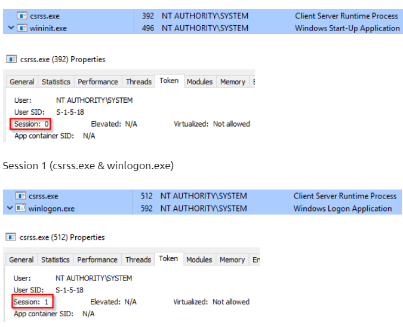

# Core Windows process

All PID is random, except System

## Task manager

Can access via GUI or command line :&#x20;

* tasklist
* Get-Process
* ps
* wmic

## System

* PID is always 4
* Path : C:\Windows\system32\ntoskrnl.exe (NT OS Kernel)
* No parent process

<figure><figcaption></figcaption></figure>

What is anormal ?&#x20;

Not running in session 0, have a parent process, have multiple instance, PID !== 4

## smss.exe (system > smss.exe)

smss.exe is know as **Windows Session Manager**. This process is responsible for creating new session. It is a first user-mode process started by the kernel

* smss will starts csrss.exe and wininit.exe in Session 0. And csrss.exe and winlogon.exe for the session 1.&#x20;

<figure><figcaption></figcaption></figure>

* And all subsystem listed in the Required value of HKLM\System\CurrentControlSet\Control\Session Manager\Subsystems is also lauched
* Path: %SystemRoot%\System32\smss.exe
* Parent process : system

