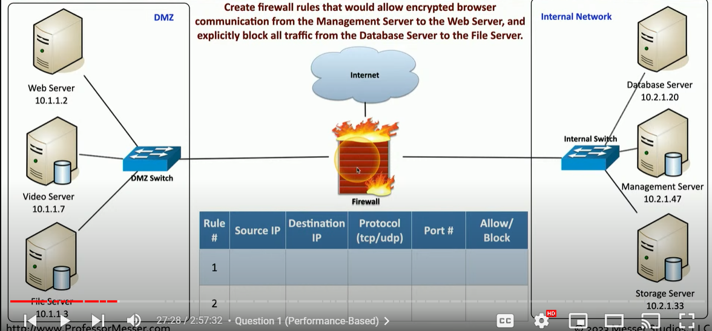

# Virus and worms

## Virus

Virus is a malware that need you to execute a program

### Common virus type

* Program virus : the virus is in a program, each time you start the program, the virus is running
* Boot virus : each time you boot your OS...
* Script virus : OS and browser-based
* Macro virus: Very common in the Microsoft Office (Excel, Word etc..)&#x20;

### Fireless virus

* It does a good job to bypass anti-virus detection. The virus is not save in a file or application
* It will execute in memory

<figure><figcaption></figcaption></figure>

## Worms

Worms is a malware that self-replicates

* Doesn't need you to do anything
* Uses the network as a transmission medium
* Self-propagates adn spreads quickly
* Firewalls and IDS/IPS can block the worm, but once the worm get inside, it doesn't help much

### Wannacry worm

<figure><figcaption></figcaption></figure>
